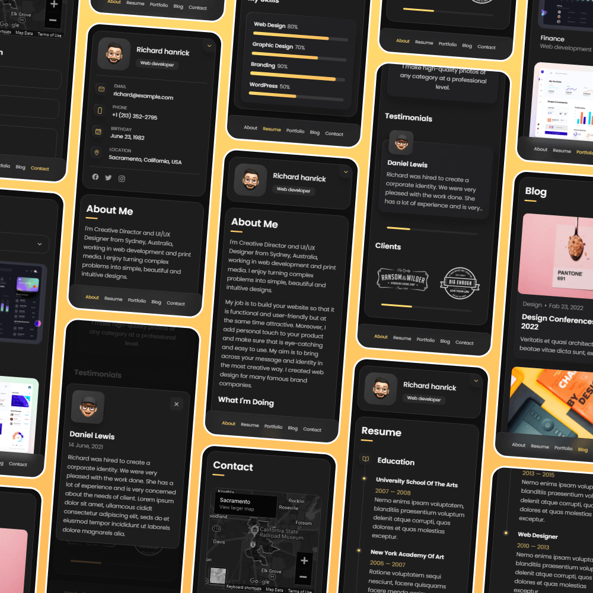

# vCard - Personal portfolio

<!-- 


[](https://twitter.com/intent/follow?screen_name=codewithsadee_)
[](https://youtu.be/SoxmIlgf2zM) -->

vCard is a fully responsive personal portfolio website, responsive for all devices, built using HTML, CSS, and JavaScript.

## Demo




## Prerequisites

Before you begin, ensure you have met the following requirements:

* [Git](https://git-scm.com/downloads "Download Git") must be installed on your operating system.

## Installing vCard

To install **vCard**, follow these steps:

Linux and macOS:

```bash
sudo git clone https://github.com/abhranilp1998/portfolio.git
```

Windows:

```bash
git clone https://github.com/abhranilp1998/portfolio.git
```

## Project Structure & Documentation

This section provides a detailed overview of the project structure, the role of each file/folder, and how the elements are used across the project.

### 1. Project Overview

**vCard** is a fully responsive personal portfolio website built with HTML, CSS, and JavaScript. It showcases personal information, projects, blogs, and contact details in a modern, mobile-friendly layout.

### 2. File & Folder Structure

```
portfolio/
├── assets/
│   ├── css/
│   │   └── style.css         # Main stylesheet for all pages
│   ├── images/               # All images and icons used in the site
│   └── js/
│       └── script.js         # Main JavaScript file for interactivity
├── index.html                # Main HTML file (entry point)
├── index.txt                 # (Not used by the website, possibly for notes)
├── LICENSE                   # Project license
├── README.md                 # Project documentation
└── website-demo-image/       # Demo screenshots for README
```

### 3. Element Usage Map

#### **HTML (index.html)**
- **Purpose:** Main structure and content of the website.
- **Elements Used:**
  - `<header>`, `<nav>`, `<main>`, `<section>`, `<footer>`: Layout structure.
  - ``: Displays images from `assets/images/`.
  - `<link rel="stylesheet">`: Links to `assets/css/style.css`.
  - `<script src="assets/js/script.js">`: Adds interactivity.
  - Various `<div>`, `<span>`, `<a>`, `<ul>`, `<li>`, `<h1>`-`<h6>`, `<p>`: Content and layout.
- **Importance:** Central file; all content and references to assets originate here.

#### **CSS (assets/css/style.css)**
- **Purpose:** Styles the entire website, including layout, colors, fonts, responsiveness, and animations.
- **Elements Styled:**
  - All HTML elements in `index.html`.
  - Custom classes and IDs for sections, buttons, cards, etc.
  - Responsive design for mobile and desktop.
- **Importance:** Essential for visual appearance and user experience.

#### **JavaScript (assets/js/script.js)**
- **Purpose:** Adds interactivity (e.g., menu toggles, animations, form handling).
- **Elements Used:**
  - DOM elements selected via classes/IDs defined in `index.html`.
  - Event listeners for user actions (clicks, scrolls, etc.).
- **Importance:** Enhances user experience with dynamic features.

#### **Images & Icons (assets/images/)**
- **Purpose:** Visual content for the site (avatars, project images, icons, logos).
- **Usage:**
  - Referenced in `index.html` via `` tags.
  - Some icons may be used as CSS backgrounds or inline SVGs.
- **Importance:** Key for branding, portfolio showcase, and visual appeal.

#### **Demo Images (website-demo-image/)**
- **Purpose:** Screenshots for README documentation only.
- **Usage:**
  - Not used in the website itself; only referenced in `README.md`.
- **Importance:** For project presentation on GitHub.

#### **index.txt**
- **Purpose:** Not used by the website. May contain notes or drafts.
- **Importance:** Not essential for site functionality.

### 4. How the Pieces Work Together
- `index.html` is the entry point, referencing `style.css` for styles and `script.js` for interactivity.
- All images/icons are loaded from `assets/images/`.
- The CSS ensures the site is responsive and visually appealing.
- The JavaScript file adds dynamic behavior (e.g., navigation, animations).
- Demo images are for documentation only and do not affect the website.

### 5. Customization & Contribution Tips
- **To change styles:** Edit `assets/css/style.css`.
- **To update content:** Modify `index.html`.
- **To add interactivity:** Update `assets/js/script.js`.
- **To add new images:** Place them in `assets/images/` and reference them in `index.html`.
- **For documentation:** Update `README.md` and add new screenshots to `website-demo-image/` if needed.

---

For any questions or contributions, please refer to the [Contact](#contact) section above.

## Contact

If you want to contact me you can let me know..

<!-- ## License

MIT -->
